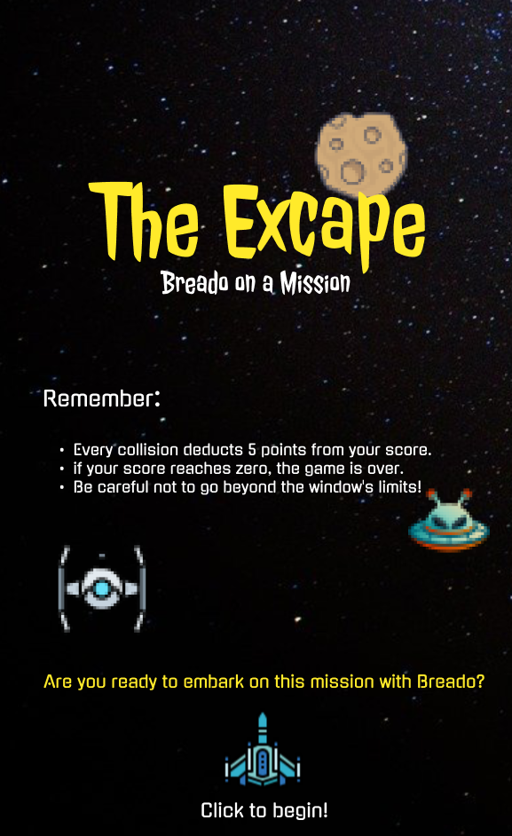
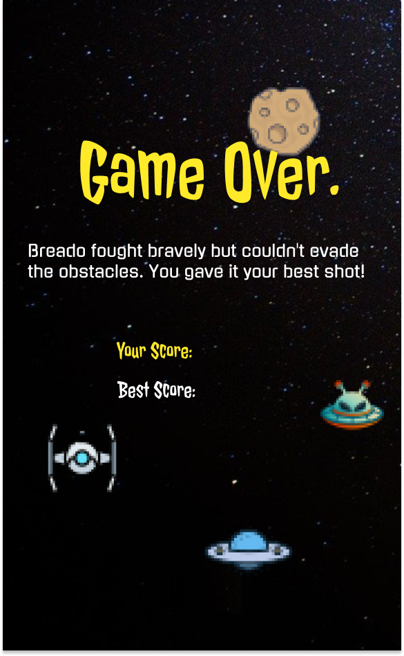

# Game Title: The Excape

## Description:
The Excape is a thrilling 2D endless runner game set in the vast expanse of outer space. Players control a nimble spacecraft tasked with navigating through a dense field of asteroids. The objective is simple: survive as long as possible by avoiding collisions with incoming obstacles.

The game features intuitive controls, allowing players to maneuver the spacecraft left and right to dodge incoming asteroids. As players progress, the speed of the game dynamically increases, ramping up the challenge and intensity. With captivating visuals and immersive sound effects, The Excape offers a thrilling gaming experience that will keep players on the edge of their seats.

## Features:
- Endless runner gameplay set in space.
- Simple and intuitive controls for easy navigation.
- Increasing difficulty as players progress.
- Stunning visuals and immersive sound effects.
- Free to play and suitable for players of all ages.

## How to Play:
1. Run the command `python game.py` or simply click on the `game.py` file to start playing.
2. Use the left and right arrow keys to maneuver the spacecraft and avoid asteroids.
3. Survive as long as possible to achieve the highest score.

## Gallery:
The `gallery` folder contains all the visual assets, including images and music, used in the game.

## Screenshots:

## Credits:
- Developed by [Surya Verma](https://www.linkedin.com/in/surya-verma/)
- Music and sound effects sourced from [Pixabay](https://pixabay.com/sound-effects/)

## Requirements:
- Python 3.x
- Pygame library

Enjoy the game and happy dodging!